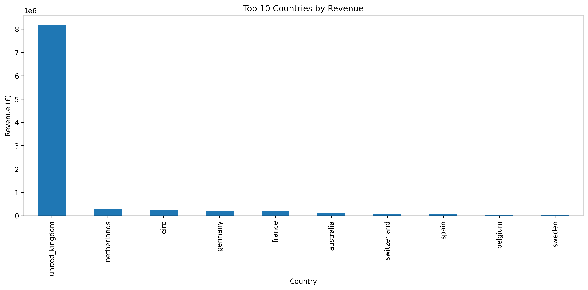
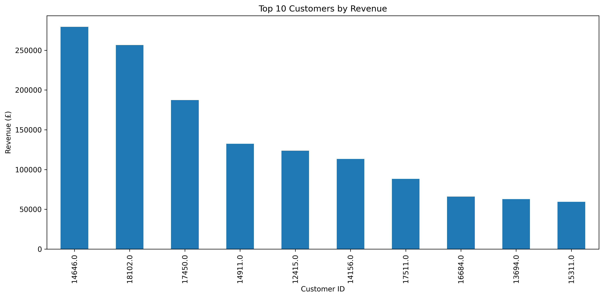
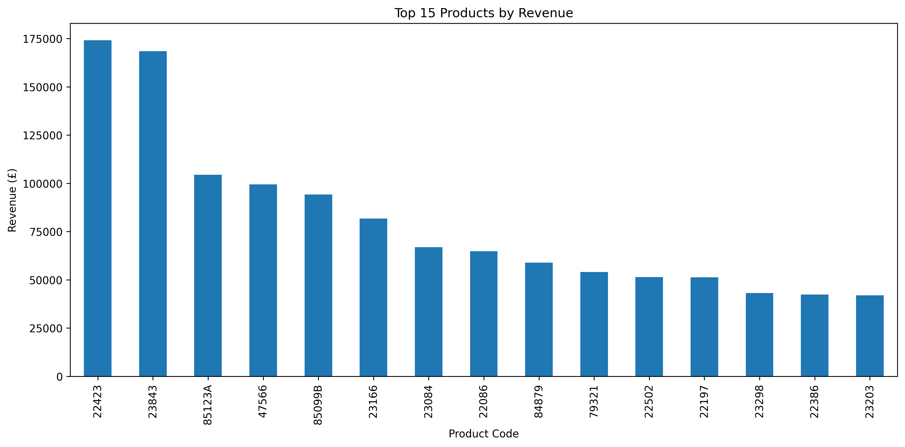
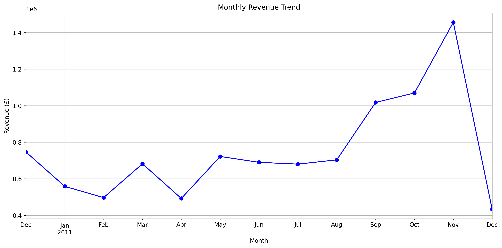
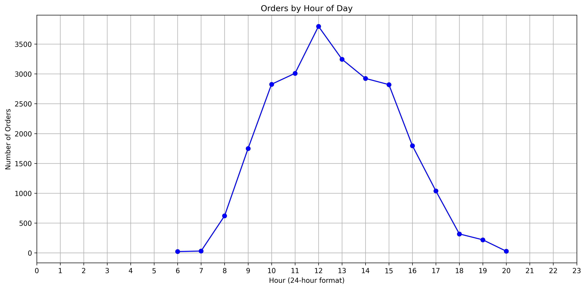
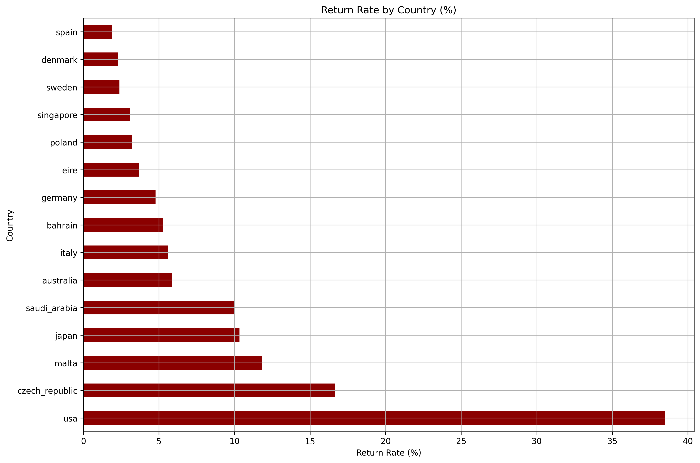
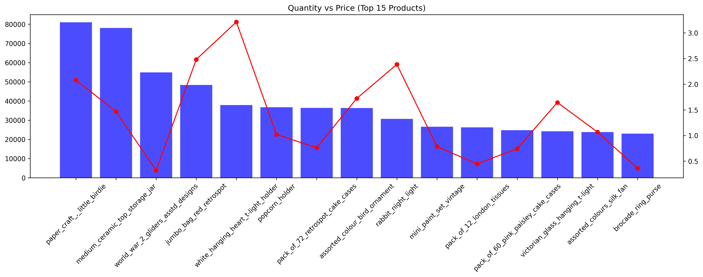
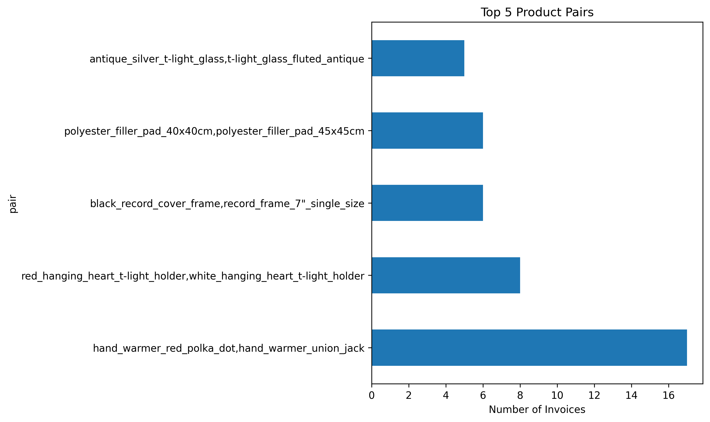

# UK Online Retail – Data Analysis Project 📊

End-to-end data science project analysing **541,909** raw UK online retail transactions (535,185 after cleaning). From raw Excel to clean data, exploratory analysis, and actionable business recommendations — this project demonstrates a complete data pipeline with a business-first mindset.

---

## Key Findings

| Metric | Value |
| :--- | :--- |
| Total Revenue | **£9,748,131** |
| Unique Customers | **4,372** |
| Unique Invoices | **24,444** |
| Average Order Value | **£398.79** |
| Return Rate (row-level) | **1.82%** |
| UK Revenue | **£8,189,252** (~84%) |

- **Revenue is UK-centric** — the UK accounts for ~84% of total revenue; Netherlands, Ireland (Eire), and Germany are the next-largest markets, though far smaller by comparison.
- **Top customers drive a concentrated share of revenue** — the single top customer contributes ~2.9% of total revenue.
- **Revenue climbs steadily from September, peaking in November.**
- **12 PM is the peak order hour** across the full dataset.
- **Return rates vary widely by country.** USA (38.5%), Czech Republic (16.7%), and Malta (11.8%) top the list, but these are low-volume countries. Australia (~5.9%) and Germany (~4.8%) have substantially more orders behind their return-rate estimates, making those figures more informative.
- **Cheaper products sell in much higher volume** than expensive ones (see Price vs Quantity chart).
- **Top product pair:** `hand_warmer_red_polka_dot` + `hand_warmer_union_jack`, appearing together on 17 invoices — the strongest signal in the market-basket analysis.

---

## Business Recommendations

| Area | Recommendation |
| :--- | :--- |
| Product | Bundle `hand_warmer_red_polka_dot` + `hand_warmer_union_jack` (top pair, 17 shared invoices) |
| Marketing | Test campaign timing around 12 PM, the peak order hour |
| Seasonality | Increase ad budget in **September–November**, where revenue ramps sharply into the holiday peak |
| International | Expand marketing to **Netherlands, Ireland (Eire), Germany** |
| CRM | Implement VIP loyalty program for top customers |
| Merchandising | Use high-volume, lower-priced products as potential upsell entry points (margin data would be needed to confirm loss-leader viability) |
| Logistics | Investigate return rates in **Australia (~5.9%)** and **Germany (~4.8%)** — these have far more orders behind them than USA/Czech Republic/Malta, so they're a more informative starting point |

---

## Tech Stack
- **Python 3.12** – Pandas, NumPy, Matplotlib
- **Jupyter Notebook** – Interactive development & storytelling
- **VS Code** – IDE with virtual environment

---

## Project Structure

```
.
├── .gitignore
├── data/
│   ├── raw/
│   │   ├── Online Retail.xlsx              # Original UCI dataset
│   │   └── online_retail_data.csv          # Excel converted to CSV
│   └── processed/
│       ├── online_retail_data_clean.csv    # Output of 01_loading_cleaning
│       └── online_retail_data_clean_eda.csv# Enriched with revenue & is_return
├── notebooks/
│   ├── 01_loading_cleaning.ipynb           # Data cleaning pipeline
│   └── 02_exploratory_data_analysis.ipynb  # EDA + 8 charts + recommendations
├── reports/
│   └── figures/                            # All 8 charts exported as PNGs
│       ├── top_countries_revenue.png
│       ├── top_customers_revenue.png
│       ├── top_products_revenue.png
│       ├── monthly_revenue_trend.png
│       ├── orders_by_hour.png
│       ├── return_rate_by_country.png
│       ├── price_vs_quantity.png
│       └── top_product_pairs.png
└── scripts/
    └── xlsx_to_csv.ipynb                   # Converts raw .xlsx to .csv
```

---

## How to Reproduce

### 1. Set up a virtual environment
```bash
python -m venv .venv
source .venv/bin/activate      # Linux/Mac
.venv\Scripts\activate         # Windows
```

### 2. Install dependencies
```bash
pip install pandas numpy matplotlib openpyxl jupyter
```

### 3. Get the raw data
Download `Online Retail.xlsx` from the [UCI Machine Learning Repository](https://archive.ics.uci.edu/dataset/352/online+retail) and place it in `data/raw/`.

### 4. Run the notebooks in order
1. `scripts/xlsx_to_csv.ipynb` → converts the raw Excel file to `data/raw/online_retail_data.csv`
2. `notebooks/01_loading_cleaning.ipynb` → cleans the data, saves `data/processed/online_retail_data_clean.csv`
3. `notebooks/02_exploratory_data_analysis.ipynb` → runs EDA, exports figures, saves `data/processed/online_retail_data_clean_eda.csv`

---

## Data Cleaning Summary

| Step | Action | Rows Remaining |
| :--- | :--- | :--- |
| Start | Raw data | 541,909 |
| 1 | Removed duplicates | 536,641 |
| 2 | Dropped missing descriptions | 535,187 |
| 3 | Removed negative unit prices (2 "adjust bad debt" rows) | 535,185 |
| **Final** | **Clean dataset** | **535,185** |

Negative quantities (returns) and £0 unit prices (samples/promos/adjustments) were **retained** — they're analysed via the `is_return` flag and excluded only where relevant (e.g. revenue-by-product calculations).

---

## Key Charts (Exported)

All visualisations are saved as high-resolution PNGs in `reports/figures/`.

### 1. Top 10 Countries by Revenue
UK dominates (£8.2M, ~84% of total).



### 2. Top Customers by Revenue
Top customer contributes ~2.9% of total.



### 3. Top 15 Products by Revenue
High-ticket items drive revenue.



### 4. Monthly Revenue Trend
Steady growth from September, peaking in November.



### 5. Orders by Hour of Day
Peak at 12 PM (lunchtime).



### 6. Return Rate by Country
USA (38.5%), Czech Republic (16.7%), Malta (11.8%) are all low-volume and should be filtered before drawing conclusions; Australia (~5.9%) and Germany (~4.8%) have far more orders behind them, making those estimates more informative.



### 7. Price vs Quantity Sold
Cheaper items sell in higher volume.



### 8. Frequently Bought Together
Top pair: `hand_warmer_red_polka_dot` + `hand_warmer_union_jack` (17 shared invoices).



---

## Next Steps
- Customer segmentation for targeted retention
- Calculate Customer Lifetime Value (CLV)
- Advanced market basket analysis (support, confidence, lift)
- A/B test email timing
- Investigate Germany and Australia return rate drivers

---

## Data Source
**UCI Machine Learning Repository – Online Retail**
[Dr. Daqing Chen, School of Computing, Engineering and Mathematics, University of Greenwich](https://archive.ics.uci.edu/dataset/352/online+retail)

---

## License
This project is for portfolio purposes. The dataset is publicly available for academic and research use.

---

## Acknowledgements
- UCI Machine Learning Repository for providing the dataset
- Open-source Python ecosystem (Pandas, NumPy, Matplotlib, Jupyter)
